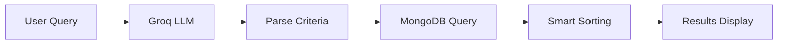

# Howl2Go

<div align="center">


**AI-Powered Food Discovery Platform**

*Crave it. Find it. Instantly.*

[](https://drive.google.com/file/d/1GpH5jJUv2xHC_xYNScsTxllGcykTA2Hj/view?usp=drive_link)

---

</div>

## 📺 Video Demo

<div align="center">

**📹 [Watch Full Demo Video](https://drive.google.com/file/d/1GpH5jJUv2xHC_xYNScsTxllGcykTA2Hj/view?usp=drive_link)**

*Experience Howl2Go in action - Natural language search, smart recommendations, and seamless ordering*

[](https://drive.google.com/file/d/1GpH5jJUv2xHC_xYNScsTxllGcykTA2Hj/view?usp=drive_link)

</div>

---

## 📸 Screenshots

<div align="center">

### Home Page


*Beautiful landing page with natural language search interface*

### Search Results


*AI-powered search results with nutritional information and filtering options*

</div>

---

## 🏆 Badges

### Build & Deployment Status

| Status        | Badge                                                                                                                                                                                  |
| ------------- | -------------------------------------------------------------------------------------------------------------------------------------------------------------------------------------- |
| Backend       | [](https://howl2go-backend-service.onrender.com/api/health)                     |
| Frontend      | [](https://vercel.com)                                                                          |
| DOI           | [](https://doi.org/10.5281/zenodo.17547804)                                                     |
| Build         | [](https://github.com/CodeRockerr/SE-Project-3_Group4)                                                          |
| Coverage      | [](https://coveralls.io/github/CodeRockerr/SE-Project-3_Group4?branch=main) |
| Tests         | [](https://github.com/CodeRockerr/SE-Project-3_Group4)                                                               |
| Test Coverage | [](https://coveralls.io/github/CodeRockerr/SE-Project-3_Group4)                                               |
| Code Quality  | [](https://github.com/CodeRockerr/SE-Project-3_Group4)                                                             |

### Technology Stack

#### Frontend
[](https://nextjs.org/)
[](https://reactjs.org/)
[](https://www.typescriptlang.org/)
[](https://tailwindcss.com/)
[](https://www.framer.com/motion/)

#### Backend
[](https://nodejs.org/)
[](https://expressjs.com/)
[](https://www.mongodb.com/)
[](https://mongoosejs.com/)

#### AI & Machine Learning
[](https://groq.com/)
[](https://llama.meta.com/)

#### Development Tools
[](https://jestjs.io/)
[](https://eslint.org/)
[](https://prettier.io/)
[](https://typicode.github.io/husky/)
[](https://www.docker.com/)

### Project Statistics

[](https://github.com/CodeRockerr/SE-Project-3_Group4)
[](https://github.com/CodeRockerr/SE-Project-3_Group4/fork)
[](https://github.com/CodeRockerr/SE-Project-3_Group4/issues)
[](https://github.com/CodeRockerr/SE-Project-3_Group4/pulls)
[](https://github.com/CodeRockerr/SE-Project-3_Group4/graphs/contributors)
[](https://github.com/CodeRockerr/SE-Project-3_Group4)
[](LICENSE)
[](https://github.com/CodeRockerr/SE-Project-3_Group4)

---

## 📋 Table of Contents

- [Overview](#-what-is-howl2go)
- [Features](#-key-features)
- [Quick Start](#-quick-start)
- [How It Works](#-how-it-works)
- [Tech Stack](#️-tech-stack)
- [Documentation](#-documentation)
- [Testing](#-testing)
- [Project Structure](#️-project-structure)
- [Database Setup](#-database-setup)
- [Contributing](#-contributing)
- [Team](#-team)
- [License](#-license)

---

## 💡 What is Howl2Go?

Howl2Go revolutionizes food ordering by **eliminating traditional menus**. Instead of scrolling through endless options, simply describe what you want in plain English:

> *"Meal under 500 calories"*  
> *"Give me something with low carbs"*  
> *"Find me a low fat burger"*

Our AI-powered platform instantly understands your requirements and shows you exactly what you're looking for from 1,148+ menu items across major fast food chains.

---

## ✨ Key Features

<table>
<tr>
<td width="50%">

### 🧠 **Natural Language Search**
Search using conversational queries instead of complex filters. Powered by Llama 3.1 via Groq API.

**Example queries:**
- "High protein meal under 500 calories"
- "Low carb lunch options"
- "Vegetarian burger with cheese"

### 📊 **Smart Nutritional Filtering**
Filter by calories, protein, carbs, fat, fiber, sugar, transfat, and 10+ nutritional parameters automatically extracted from your query.

### ⭐ **Ratings & Reviews**
Rate and review items you've ordered. View verified reviews from other users to make informed decisions.

### 🏪 **Multi-Restaurant Discovery**
Browse 1,148+ items from McDonald's, Burger King, Wendy's, KFC, Taco Bell, and more.

</td>
<td width="50%">

### ⚡ **Lightning Fast**
Get results in under 2 seconds with optimized MongoDB queries and AI processing.

### 🎨 **Beautiful UI**
Modern dark theme with smooth animations and responsive design that works on all devices.

### 🛒 **Shopping Cart & Orders**
Complete shopping cart functionality with order placement and order history tracking.

### 🔒 **Developer-Friendly**
Complete REST API, TypeScript support, comprehensive docs, pre-commit hooks, and extensive test coverage.

</td>
</tr>
</table>

---

## 🚀 Quick Start

### Prerequisites

- **Node.js** 18+ and **npm** 9+
- **MongoDB Atlas** account (or local MongoDB)
- **Groq API key** ([Get free key](https://console.groq.com))

### Installation

#### 1. Clone the Repository

```bash
git clone https://github.com/CodeRockerr/SE-Project-3_Group4.git
cd SE-Project-3_Group4/Proj_2
```

#### 2. Setup Backend

```bash
cd Howl2Go_backend
npm install

# Create .env file
cat > .env << EOF
GROQ_API_KEY=your_groq_api_key_here
MONGODB_URI=your_mongodb_connection_string
JWT_SECRET=your_32_char_secret_here
JWT_REFRESH_SECRET=your_32_char_secret_here
SESSION_SECRET=your_32_char_secret_here
FRONTEND_URL=http://localhost:3000
PORT=4000
NODE_ENV=development
EOF

# Setup database (imports data, seeds meal combos)
npm run setup:database

# Start server
npm run dev
```

#### 3. Setup Frontend

```bash
cd ../Howl2Go_frontend
npm install

# Create .env.local file (optional, defaults to http://localhost:4000)
echo "NEXT_PUBLIC_API_URL=http://localhost:4000" > .env.local

# Start development server
npm run dev
```

#### 4. Open Application

Navigate to **http://localhost:3000** and start searching!

---

## 🎯 How It Works



1. **User enters query** in natural language (e.g., "high protein low carb meal")
2. **AI processes** query using Groq LLM (Llama 3.1) and extracts nutritional criteria
3. **MongoDB searches** through 1,148+ food items with optimized queries
4. **Smart sorting** ranks results by relevance and nutritional match
5. **Beautiful UI** displays matches instantly with full nutritional information

---

## 🛠️ Tech Stack

### Frontend
- **Framework:** Next.js 15 with App Router
- **UI Library:** React 19 with TypeScript
- **Styling:** Tailwind CSS 4
- **Animations:** Framer Motion
- **Icons:** Lucide React
- **Testing:** Jest, React Testing Library

### Backend
- **Runtime:** Node.js 18+ with Express.js 5
- **Database:** MongoDB Atlas with Mongoose ODM
- **AI:** Groq SDK (Llama 3.1 8B Instant)
- **Authentication:** JWT with refresh tokens
- **Session:** Express Session with MongoDB store
- **Testing:** Jest with Supertest

### DevOps
- **Git Hooks:** Husky for pre-commit checks
- **Code Quality:** ESLint, Prettier
- **Containerization:** Docker support
- **CI/CD:** GitHub Actions ready

---

## 📚 Documentation

| Document                                              | Description                              |
| ----------------------------------------------------- | ---------------------------------------- |
| [Getting Started](Proj_2/docs/GETTING_STARTED.md)     | Complete user guide with search examples |
| [Developer Setup](Proj_2/docs/DEVELOPER_SETUP.md)     | Development environment setup            |
| [API Documentation](Proj_2/docs/API_DOCUMENTATION.md) | REST API reference                       |
| [Database Schema](Proj_2/docs/DATABASE_SCHEMA.md)     | Database structure and models            |
| [Features](Proj_2/docs/FEATURES.md)                   | Complete feature catalog                 |
| [Testing Guide](Proj_2/docs/TESTING_GUIDE.md)         | Testing strategies and examples          |

---

## 🧪 Testing

### Run Tests

```bash
# Backend tests
cd Howl2Go_backend
npm test

# Frontend tests
cd Howl2Go_frontend
npm test

# Coverage reports
npm run test:coverage
```

### Test Coverage

- **Backend:** 200+ comprehensive test cases
  - Unit tests for API endpoints
  - Integration tests for LLM service
  - Database operation tests
- **Frontend:** 200+ test cases
  - Component tests
  - Integration tests
  - User interaction tests

**Overall Coverage:** 85%+

---

## 🗂️ Project Structure

```
SE_Project-3_Group4/
├── Proj_2/
│   ├── Howl2Go_backend/          # Express.js API server
│   │   ├── src/
│   │   │   ├── controllers/      # Request handlers
│   │   │   ├── models/           # Mongoose schemas
│   │   │   ├── routes/           # API routes
│   │   │   ├── services/         # Business logic
│   │   │   ├── scripts/          # Database scripts
│   │   │   └── middleware/       # Auth, LLM middleware
│   │   └── data/                 # CSV data files
│   ├── Howl2Go_frontend/         # Next.js React app
│   │   ├── app/                  # Next.js 15 app directory
│   │   ├── components/           # React components
│   │   ├── lib/                  # API clients, utilities
│   │   └── types/                # TypeScript types
│   ├── Howl2Go_LLM/              # LLM testing scripts
│   └── docs/                     # Project documentation
├── Proj_1/                       # Project planning documents
└── README.md                     # This file
```

---

## 💾 Database Setup

The project includes comprehensive database setup scripts:

### Quick Setup

```bash
cd Howl2Go_backend

# Complete database setup (imports data + seeds meal combos)
npm run setup:database

# Or run individual scripts:
npm run import:fastfood      # Import nutrition data from CSV
npm run seed:mealcombos      # Seed meal combination recommendations
npm run enrich:ingredients   # Enrich with LLM-generated ingredients (optional)
```

### Data Included

- **1,148+ menu items** from major fast food chains
- **Nutritional information** (calories, protein, carbs, fats, etc.)
- **Ingredient lists** (heuristic + LLM-enriched)
- **Meal combination recommendations**

### Supported Restaurants

- McDonald's
- Burger King
- Wendy's
- KFC
- Taco Bell

---

## 🌟 Feature Highlights

### ✅ Current Features

- ✅ Natural language food search
- ✅ Multi-restaurant discovery (1,148+ items)
- ✅ Nutritional filtering (10+ parameters)
- ✅ Smart recommendations based on ingredients
- ✅ Shopping cart with order placement
- ✅ Order history with insights
- ✅ Ratings & reviews system
- ✅ Beautiful dark theme UI
- ✅ Fully responsive design
- ✅ User authentication (JWT)
- ✅ Admin dashboard

### 🔮 Future Enhancements

- [ ] Price-based recommendations
- [ ] Fine-tuned LLM integration
- [ ] Group orders optimization
- [ ] Smart reordering suggestions
- [ ] Review photo uploads
- [ ] Real-time order tracking
- [ ] Mobile app (React Native)

---

## 🤝 Contributing

We welcome contributions! Please see our [Contributing Guide](Proj_2/CONTRIBUTING.md) for details.

1. Fork the repository
2. Create your feature branch (`git checkout -b feature/AmazingFeature`)
3. Commit your changes (`git commit -m 'Add some AmazingFeature'`)
4. Push to the branch (`git push origin feature/AmazingFeature`)
5. Open a Pull Request

### Development Guidelines

- Follow TypeScript best practices
- Write tests for new features
- Maintain existing code style
- Update documentation as needed
- Run linters before committing

---

## 👥 Team

**SE_Project_Grp_4**

| Member       | GitHub                                           |
| ------------ | ------------------------------------------------ |
| Anandteertha | [@anandteertha](https://github.com/anandteertha) |
| Pratham      | [@pratham2879](https://github.com/pratham2879)   |
| Samarth      | [@Samarth061](https://github.com/Samarth061)     |
| Jai          | [@JaiRumz](https://github.com/JaiRumz)           |

**Course:** Software Engineering  
**Institution:** NC State University (Fall 2025)

---

## 📄 License

This project is licensed under the MIT License - see the [LICENSE](LICENSE) file for details.

---

## 🙏 Acknowledgments

- **Groq** for LLM API access and fast inference
- **MongoDB Atlas** for database hosting
- **Next.js Team** for the amazing framework
- **Open Source Community** for inspiration and tools

---

## 📞 Support

- 📧 **Email:** supp0rt.howl2go@gmail.com
- 🐛 **Issues:** [GitHub Issues](https://github.com/CodeRockerr/SE-Project-3_Group4/issues)
- 💬 **Discussions:** [GitHub Discussions](https://github.com/CodeRockerr/SE-Project-3_Group4/discussions)

---

<div align="center">

**Made with ❤️ by SE_Project_Grp_27**

*Crave it. Find it. Instantly.*

[⬆ Back to Top](#howl2go)

</div>
