<div align="center">

# 🍔 Howl2Go

<div align="center">


*High-level overview of Howl2Go – mission, stakeholders, features, tech stack, and test metrics.*

</div>


**🤖 AI-Powered Food Discovery Platform**

*Crave it. Find it. Instantly.* 🚀

[](https://youtu.be/ZVE26hXL6yo)
[](https://vercel.com)
[](Proj_3/docs/)

---

</div>

## 📺 Video Demo

<div align="center">

**📹 [Watch Full Demo Video](https://youtu.be/ZVE26hXL6yo)**

*Experience Howl2Go in action - Natural language search, smart recommendations, and seamless ordering*

[](https://youtu.be/ZVE26hXL6yo)

</div>

---

## 📸 Screenshots

<div align="center">

### 🏠 Home Page


*Beautiful landing page with natural language search interface*

### 🔍 Search Results


*AI-powered search results with nutritional information and filtering options*

</div>

---

## 🏆 Badges & Status

<div align="center">

### 🌐 Deployment & Infrastructure

[](https://howl2go-backend-service.onrender.com/api/health)
[](https://vercel.com)
[](https://www.mongodb.com/cloud/atlas)
[](https://github.com/CodeRockerr/se_project-3_group4/actions)
[](https://www.docker.com/)
[](https://doi.org/10.5281/zenodo.17547804)

### ✅ Build & Quality

[](https://github.com/CodeRockerr/se_project-3_group4)
[](https://coveralls.io/github/CodeRockerr/se_project-3_group4?branch=main)
[](https://github.com/CodeRockerr/se_project-3_group4)
[](https://coveralls.io/github/CodeRockerr/se_project-3_group4)
[](https://github.com/CodeRockerr/se_project-3_group4)
[](https://prettier.io/)
[](https://eslint.org/)

### 🔒 Security & Performance

[](https://github.com/CodeRockerr/se_project-3_group4)
[](https://www.npmjs.com/)
[](https://github.com/CodeRockerr/se_project-3_group4)
[](https://github.com/CodeRockerr/se_project-3_group4)
[](https://github.com/CodeRockerr/se_project-3_group4)
[](https://github.com/CodeRockerr/se_project-3_group4)

### 💻 Frontend Technologies

[](https://nextjs.org/)
[](https://reactjs.org/)
[](https://www.typescriptlang.org/)
[](https://tailwindcss.com/)
[](https://www.framer.com/motion/)
[](https://lucide.dev/)
[](https://react-hot-toast.com/)
[](https://turbo.build/pack)

### ⚙️ Backend Technologies

[](https://nodejs.org/)
[](https://expressjs.com/)
[](https://www.mongodb.com/)
[](https://mongoosejs.com/)
[](https://jwt.io/)
[](https://www.npmjs.com/package/bcrypt)
[](https://www.npmjs.com/package/express-session)
[](https://stripe.com/)

### 🤖 AI & Machine Learning

[](https://groq.com/)
[](https://llama.meta.com/)
[](https://groq.com/)
[](https://github.com/CodeRockerr/se_project-3_group4)

### 🧪 Testing & Quality Assurance

[](https://jestjs.io/)
[](https://testing-library.com/)
[](https://github.com/visionmedia/supertest)
[](https://coveralls.io/)

### 🛠️ Development Tools

[](https://eslint.org/)
[](https://prettier.io/)
[](https://typicode.github.io/husky/)
[](https://github.com/okonet/lint-staged)
[](https://nodemon.io/)
[](https://github.com/CodeRockerr/se_project-3_group4)

### 📦 Package Management

[](https://www.npmjs.com/)
[](https://nodejs.org/)
[](https://www.npmjs.com/)

### 🌐 Platform & Browser Support

[](https://github.com/CodeRockerr/se_project-3_group4)
[](https://github.com/CodeRockerr/se_project-3_group4)
[](https://github.com/CodeRockerr/se_project-3_group4)
[](https://github.com/CodeRockerr/se_project-3_group4)

### 📊 API & Database

[](https://github.com/CodeRockerr/se_project-3_group4)
[](https://github.com/CodeRockerr/se_project-3_group4)
[](https://graphql.org/)
[](https://websockets.org/)

### ✨ Features

[](https://github.com/CodeRockerr/se_project-3_group4)
[](https://github.com/CodeRockerr/se_project-3_group4)
[](https://jwt.io/)
[](https://www.mongodb.com/)
[](https://github.com/CodeRockerr/se_project-3_group4)
[](https://github.com/CodeRockerr/se_project-3_group4)

### 📈 Project Statistics

[](https://github.com/CodeRockerr/se_project-3_group4)
[](https://github.com/CodeRockerr/se_project-3_group4/fork)
[](https://github.com/CodeRockerr/se_project-3_group4/issues)
[](https://github.com/CodeRockerr/se_project-3_group4/pulls)
[](https://github.com/CodeRockerr/se_project-3_group4/graphs/contributors)
[](https://github.com/CodeRockerr/se_project-3_group4)
[](https://github.com/CodeRockerr/se_project-3_group4/releases)
[](https://github.com/CodeRockerr/se_project-3_group4)
[](https://github.com/CodeRockerr/se_project-3_group4)

### 📝 Standards & Compliance

[](LICENSE)
[](https://github.com/CodeRockerr/se_project-3_group4)
[](https://github.com/CodeRockerr/se_project-3_group4)
[](https://semver.org/)
[](https://conventionalcommits.org/)
[](CODE_OF_CONDUCT.md)

</div>

---

## 📋 Table of Contents

- [💡 What is Howl2Go?](#-what-is-howl2go)
- [✨ Key Features](#-key-features)
- [🚀 Quick Start](#-quick-start)
- [🎯 How It Works](#-how-it-works)
- [🛠️ Tech Stack](#️-tech-stack)
- [📚 Documentation](#-documentation)
- [🧪 Testing](#-testing)
- [🗂️ Project Structure](#️-project-structure)
- [💾 Database Setup](#-database-setup)
- [🌟 Feature Highlights](#-feature-highlights)
- [🤝 Contributing](#-contributing)
- [👥 Team](#-team)
- [📄 License](#-license)

---

## 💡 What is Howl2Go?

<div align="center">


</div>

Howl2Go revolutionizes food ordering by **eliminating traditional menus**. Instead of scrolling through endless options, simply describe what you want in plain English:

> 🎯 *"Meal under 500 calories"*  
> 🥗 *"Give me something with low carbs"*  
> 🍔 *"Find me a low fat burger"*

Our AI-powered platform instantly understands your requirements and shows you exactly what you're looking for from **1,148+ menu items** across major fast food chains.

**Key Highlights:**
- 🤖 Powered by **Llama 3.1** via Groq API
- ⚡ **Sub-2 second** response times
- 🎨 Beautiful, modern UI with dark theme
- 📱 Fully responsive across all devices

---

## ✨ Key Features

<div align="center">

| 🎯 Search & Discovery          | ⚡ Performance & UX         |
| ----------------------------- | -------------------------- |
| 🧠 Natural Language Search     | ⚡ Lightning Fast (<2s)     |
| 📊 Smart Nutritional Filtering | 🎨 Beautiful Dark Theme UI  |
| 🏪 Multi-Restaurant Discovery  | 📱 Fully Responsive Design  |
| 🛒 Shopping Cart & Orders      | 🔍 Real-time Search Results |
| ⭐ Ratings & Reviews           | 💾 Order History Tracking   |

</div>

<table>
<tr>
<td width="50%">

### 🧠 **Natural Language Search**


Search using conversational queries instead of complex filters. Powered by **Llama 3.1** via Groq API.

**Example queries:**
- 💪 "High protein meal under 500 calories"
- 🥗 "Low carb lunch options"
- 🍔 "Vegetarian burger with cheese"

### 📊 **Smart Nutritional Filtering**


Filter by calories, protein, carbs, fat, fiber, sugar, transfat, and **10+ nutritional parameters** automatically extracted from your query.

### ⭐ **Ratings & Reviews**


Rate and review items you've ordered. View verified reviews from other users to make informed decisions.

### 🏪 **Multi-Restaurant Discovery**


Browse **1,148+ items** from McDonald's, Burger King, Wendy's, KFC, Taco Bell, and more.

</td>
<td width="50%">

### ⚡ **Lightning Fast**


Get results in under 2 seconds with optimized MongoDB queries and AI processing.

### 🎨 **Beautiful UI**


Modern dark theme with smooth animations and responsive design that works on all devices.

### 🛒 **Shopping Cart & Orders**


Complete shopping cart functionality with order placement and order history tracking.

### 🔒 **Developer-Friendly**


Complete REST API, TypeScript support, comprehensive docs, pre-commit hooks, and extensive test coverage.

</td>
</tr>
</table>

---

## 🚀 Quick Start

### 📦 Prerequisites

<div align="center">

[](https://nodejs.org/)
[](https://www.npmjs.com/)
[](https://www.mongodb.com/cloud/atlas)
[](https://console.groq.com)

</div>

- **Node.js** 18+ and **npm** 9+
- **MongoDB Atlas** account (or local MongoDB)
- **Groq API key** ([Get free key](https://console.groq.com) 🔑)
- **Stripe account** ([Get free account](https://stripe.com) 💳) - For payment processing

### ⚙️ Installation

#### 1️⃣ Clone the Repository

```bash
git clone https://github.com/CodeRockerr/se_project-3_group4.git
cd se_project-3_group4/Proj_3
```

#### 2️⃣ Setup Backend

[](Proj_3/Howl2Go_backend)

```bash
cd Howl2Go_backend
npm install

# Create .env file
cat > .env << EOF
# Required - Database
MONGODB_URI=your_mongodb_connection_string

# Required - API Keys
GROQ_API_KEY=your_groq_api_key_here

# Required - Stripe Payment Integration
STRIPE_SECRET_KEY=sk_test_your_stripe_secret_key_here
STRIPE_PUBLISHABLE_KEY=pk_test_your_stripe_publishable_key_here
STRIPE_WEBHOOK_SECRET=whsec_your_webhook_secret_here

# Required - Authentication Secrets (generate secure random strings)
JWT_SECRET=your_32_char_secret_here
JWT_REFRESH_SECRET=your_32_char_secret_here
SESSION_SECRET=your_32_char_secret_here

# Optional - Server Configuration
FRONTEND_URL=http://localhost:3000
PORT=4000
NODE_ENV=development
EOF

# Get Stripe keys from: https://dashboard.stripe.com/test/apikeys

# Setup database (imports data, seeds meal combos)
npm run setup:database

# Start server
npm run dev
```

#### 3️⃣ Setup Frontend

[](Proj_3/Howl2Go_frontend)

```bash
cd ../Howl2Go_frontend
npm install

# Create .env.local file
cat > .env.local << EOF
# Required - Backend API URL
NEXT_PUBLIC_API_URL=http://localhost:4000

# Required - Stripe Payment Integration
NEXT_PUBLIC_STRIPE_PUBLISHABLE_KEY=pk_test_your_stripe_publishable_key_here
EOF

# Get Stripe publishable key from: https://dashboard.stripe.com/test/apikeys

# Start development server
npm run dev
```

#### 4️⃣ Open Application

<div align="center">

[](http://localhost:3000)

Navigate to **http://localhost:3000** and start searching! 🔍

</div>

---

## 🎯 How It Works

```mermaid
graph LR
    A[👤 User Query] --> B[🤖 Groq LLM]
    B --> C[📝 Parse Criteria]
    C --> D[💾 MongoDB Query]
    D --> E[🎯 Smart Sorting]
    E --> F[✨ Results Display]
```

<div align="center">



**The Howl2Go Pipeline** 🔄

</div>

1. **👤 User enters query** in natural language (e.g., "high protein low carb meal")
2. **🤖 AI processes** query using Groq LLM (Llama 3.1) and extracts nutritional criteria
3. **💾 MongoDB searches** through 1,148+ food items with optimized queries
4. **🎯 Smart sorting** ranks results by relevance and nutritional match
5. **✨ Beautiful UI** displays matches instantly with full nutritional information

---

## 🛠️ Tech Stack

### 🎨 Frontend

<div align="center">

[](https://nextjs.org/)
[](https://reactjs.org/)
[](https://www.typescriptlang.org/)
[](https://tailwindcss.com/)
[](https://www.framer.com/motion/)

</div>

- **Framework:** Next.js 15 with App Router
- **UI Library:** React 19 with TypeScript
- **Styling:** Tailwind CSS 4
- **Animations:** Framer Motion
- **Icons:** Lucide React
- **Testing:** Jest, React Testing Library

### ⚙️ Backend

<div align="center">

[](https://nodejs.org/)
[](https://expressjs.com/)
[](https://www.mongodb.com/)
[](https://mongoosejs.com/)

</div>

- **Runtime:** Node.js 18+ with Express.js 5
- **Database:** MongoDB Atlas with Mongoose ODM
- **AI:** Groq SDK (Llama 3.1 8B Instant)
- **Authentication:** JWT with refresh tokens
- **Session:** Express Session with MongoDB store
- **Testing:** Jest with Supertest

### 🚀 DevOps

<div align="center">

[](https://typicode.github.io/husky/)
[](https://eslint.org/)
[](https://prettier.io/)
[](https://www.docker.com/)

</div>

- **Git Hooks:** Husky for pre-commit checks
- **Code Quality:** ESLint, Prettier
- **Containerization:** Docker support
- **CI/CD:** GitHub Actions ready

---

## 📚 Documentation

<div align="center">

[](Proj_3/docs/)

</div>

| 📄 Document                                                                                                                                                 | 📝 Description                            |
| ---------------------------------------------------------------------------------------------------------------------------------------------------------- | ---------------------------------------- |
| [](Proj_3/docs/GETTING_STARTED.md)  | Complete user guide with search examples |
| [](Proj_3/docs/DEVELOPER_SETUP.md) | Development environment setup            |
| [](Proj_3/docs/API_DOCUMENTATION.md)          | REST API reference                       |
| [](Proj_3/docs/DATABASE_SCHEMA.md)  | Database structure and models            |
| [](Proj_3/docs/FEATURES.md)               | Complete feature catalog                 |
| [](Proj_3/docs/TESTING_GUIDE.md)               | Testing strategies and examples          |

---

## 🧪 Testing

<div align="center">

[](https://github.com/CodeRockerr/se_project-3_group4)
[](https://coveralls.io/)

</div>

### 🏃 Run Tests

```bash
# Backend tests
cd Howl2Go_backend
npm test

# Frontend tests
cd Howl2Go_frontend
npm test

# Coverage reports
npm run test:coverage
```

### 📊 Test Coverage

- **Backend:** 200+ comprehensive test cases
  - Unit tests for API endpoints
  - Integration tests for LLM service
  - Database operation tests
- **Frontend:** 200+ test cases
  - Component tests
  - Integration tests
  - User interaction tests

**Overall Coverage:** 85%+ ✅

---

## 🗂️ Project Structure

```
SE_Project-3_Group4/
├── Proj_3/
│   ├── Howl2Go_backend/          # Express.js API server
│   │   ├── src/
│   │   │   ├── controllers/      # Request handlers
│   │   │   ├── models/           # Mongoose schemas
│   │   │   ├── routes/           # API routes
│   │   │   ├── services/         # Business logic
│   │   │   ├── scripts/          # Database scripts
│   │   │   └── middleware/       # Auth, LLM middleware
│   │   └── data/                 # CSV data files
│   ├── Howl2Go_frontend/         # Next.js React app
│   │   ├── app/                  # Next.js 15 app directory
│   │   ├── components/           # React components
│   │   ├── lib/                  # API clients, utilities
│   │   └── types/                # TypeScript types
│   ├── Howl2Go_LLM/              # LLM testing scripts
│   └── docs/                     # Project documentation
├── Proj_1/                       # Project planning documents
└── README.md                     # This file
```

---

## 💾 Database Setup

<div align="center">

[](Proj_3/Howl2Go_backend/src/scripts/)

</div>

The project includes comprehensive database setup scripts:

### ⚡ Quick Setup

```bash
cd Howl2Go_backend

# Complete database setup (imports data + seeds meal combos)
npm run setup:database

# Or run individual scripts:
npm run import:fastfood      # Import nutrition data from CSV
npm run seed:mealcombos      # Seed meal combination recommendations
npm run enrich:ingredients   # Enrich with LLM-generated ingredients (optional)
```

### 📦 Data Included

- **1,148+ menu items** from major fast food chains
- **Nutritional information** (calories, protein, carbs, fats, etc.)
- **Ingredient lists** (heuristic + LLM-enriched)
- **Meal combination recommendations**

### 🏪 Supported Restaurants

[](https://www.mcdonalds.com/)
[](https://www.burgerking.com/)
[](https://www.wendys.com/)
[](https://www.kfc.com/)
[](https://www.tacobell.com/)

---

## 💳 Payment Integration (Stripe)

<div align="center">

[](https://stripe.com/)

</div>

Howl2Go includes full Stripe payment integration for secure checkout:

### ✅ Features

- ✅ **Secure Payment Processing** - PCI compliant via Stripe
- ✅ **Credit/Debit Cards** - Visa, Mastercard, Amex, Discover
- ✅ **Payment Intents** - Modern Stripe payment flow
- ✅ **Webhook Support** - Real-time payment status updates
- ✅ **Error Handling** - Comprehensive error messages
- ✅ **Test Mode** - Safe testing with test cards

### 🔧 Setup Instructions

**1. Get Stripe API Keys:**
- Sign up at [stripe.com](https://stripe.com) (free account)
- Go to [Dashboard → API Keys](https://dashboard.stripe.com/test/apikeys)
- Copy your **Test** keys (for development):
  - `pk_test_...` (Publishable key)
  - `sk_test_...` (Secret key)

**2. Configure Backend:**
```bash
# Add to Howl2Go_backend/.env
STRIPE_SECRET_KEY=sk_test_your_key_here
STRIPE_PUBLISHABLE_KEY=pk_test_your_key_here
STRIPE_WEBHOOK_SECRET=whsec_your_webhook_secret_here
```

**3. Configure Frontend:**
```bash
# Add to Howl2Go_frontend/.env.local
NEXT_PUBLIC_STRIPE_PUBLISHABLE_KEY=pk_test_your_key_here
```

**4. Test Payment:**
- Use test card: `4242 4242 4242 4242`
- Any future expiry date (e.g., 12/34)
- Any 3-digit CVC (e.g., 123)

**📚 Full Documentation:** See [Payment Setup Guide](Proj_3/docs/PAYMENT_SETUP.md)

---

## 🌟 Feature Highlights

### ✅ Current Features

<div align="center">

[](Proj_3/docs/FEATURES.md)

</div>

- ✅ Natural language food search
- ✅ Multi-restaurant discovery (1,148+ items)
- ✅ Nutritional filtering (10+ parameters)
- ✅ Smart recommendations based on ingredients
- ✅ Shopping cart with order placement
- ✅ Order history with insights
- ✅ Ratings & reviews system
- ✅ Beautiful dark theme UI
- ✅ Fully responsive design
- ✅ User authentication (JWT)
- ✅ Admin dashboard

### 🔮 Future Enhancements

- [ ] Price-based recommendations
- [ ] Fine-tuned LLM integration
- [ ] Group orders optimization
- [ ] Smart reordering suggestions
- [ ] Review photo uploads
- [ ] Real-time order tracking
- [ ] Mobile app (React Native)
- [ ] Apple Pay / Google Pay integration
- [ ] Saved payment methods
- [ ] Subscription plans

---

## 🚀 Production Deployment

<div align="center">

[]()

</div>

### ✅ Pre-Deployment Checklist

**Environment Variables:**
- [ ] All API keys configured (Groq, Stripe, MongoDB)
- [ ] JWT secrets are secure (32+ characters, random)
- [ ] `NODE_ENV=production` set
- [ ] HTTPS enabled for Stripe webhooks
- [ ] Frontend URL configured correctly

**Security:**
- [ ] Stripe keys switched to **Live mode** (production)
- [ ] Webhook endpoint configured in Stripe Dashboard
- [ ] Webhook secret updated for production
- [ ] CORS configured for production domain
- [ ] Session cookies secure (`secure: true`, `sameSite: 'none'`)

**Database:**
- [ ] MongoDB Atlas cluster configured
- [ ] Database indexes created
- [ ] Backup strategy in place
- [ ] Connection pooling optimized

**Monitoring:**
- [ ] Error logging configured
- [ ] Payment webhook monitoring
- [ ] Server health checks
- [ ] Performance monitoring

**Documentation:**
- [ ] API documentation updated
- [ ] Deployment guides reviewed
- [ ] Team access documented

### 📋 Production Environment Variables

**Backend:**
```env
NODE_ENV=production
MONGODB_URI=mongodb+srv://...
GROQ_API_KEY=gsk_...
STRIPE_SECRET_KEY=sk_live_...  # Live mode key!
STRIPE_PUBLISHABLE_KEY=pk_live_...  # Live mode key!
STRIPE_WEBHOOK_SECRET=whsec_...
JWT_SECRET=<secure-random-32-chars>
JWT_REFRESH_SECRET=<secure-random-32-chars>
SESSION_SECRET=<secure-random-32-chars>
FRONTEND_URL=https://your-domain.com
PORT=4000
```

**Frontend:**
```env
NEXT_PUBLIC_API_URL=https://api.your-domain.com
NEXT_PUBLIC_STRIPE_PUBLISHABLE_KEY=pk_live_...  # Live mode key!
```

### 🔐 Stripe Production Setup

1. **Switch to Live Mode:**
   - In Stripe Dashboard, toggle to **Live mode**
   - Get your **Live API keys**
   - Update environment variables

2. **Configure Webhook:**
   - Create webhook endpoint: `https://api.your-domain.com/api/payments/webhook`
   - Subscribe to events:
     - `payment_intent.succeeded`
     - `payment_intent.payment_failed`
     - `payment_intent.canceled`
     - `charge.refunded`
   - Copy webhook signing secret

3. **Test Payments:**
   - Use Stripe's test mode initially
   - Test with real small amounts
   - Monitor webhook deliveries

**📚 Detailed Guide:** [Production Deployment Guide](Proj_3/docs/PAYMENT_SETUP.md#production-deployment)

---

## 🤝 Contributing

<div align="center">

[](Proj_3/CONTRIBUTING.md)

</div>

We welcome contributions! Please see our [Contributing Guide](Proj_3/CONTRIBUTING.md) for details.

1. Fork the repository
2. Create your feature branch (`git checkout -b feature/AmazingFeature`)
3. Commit your changes (`git commit -m 'Add some AmazingFeature'`)
4. Push to the branch (`git push origin feature/AmazingFeature`)
5. Open a Pull Request

### 📋 Development Guidelines

- Follow TypeScript best practices
- Write tests for new features
- Maintain existing code style
- Update documentation as needed
- Run linters before committing

---

## 👥 Team

<div align="center">

**SE_Project_Grp_4** 👨‍💻👩‍💻

[](https://github.com/CodeRockerr/se_project-3_group4/graphs/contributors)

</div>

| 👤 Member     | 🔗 GitHub                                                                                                                                      | 🏷️ Role    |
| ------------ | --------------------------------------------------------------------------------------------------------------------------------------------- | --------- |
| Anandteertha | [](https://github.com/anandteertha) | Developer |
| Adit         | [](https://github.com/CodeRockerr)   | Developer |
| Advait       | [](https://github.com/Advait2207)     | Developer |
| Kavya        | [](https://github.com/KavyaGujjala)      | Developer |

**📚 Course:** Software Engineering  
**🏫 Institution:** NC State University (Fall 2025)

---

## 📄 License

<div align="center">

[](LICENSE)

</div>

This project is licensed under the **MIT License** - see the [LICENSE](LICENSE) file for details.

---

## 🙏 Acknowledgments

<div align="center">

[]()

</div>

- **Groq** for LLM API access and fast inference
- **MongoDB Atlas** for database hosting
- **Next.js Team** for the amazing framework
- **Open Source Community** for inspiration and tools

---

## 📞 Support

<div align="center">

[](mailto:supp0rt.howl2go@gmail.com)
[](https://github.com/CodeRockerr/se_project-3_group4/issues)
[](https://github.com/CodeRockerr/se_project-3_group4/discussions)

</div>

- 📧 **Email:** supp0rt.howl2go@gmail.com
- 🐛 **Issues:** [GitHub Issues](https://github.com/CodeRockerr/se_project-3_group4/issues)
- 💬 **Discussions:** [GitHub Discussions](https://github.com/CodeRockerr/se_project-3_group4/discussions)

---

<div align="center">

## Made with ❤️ by SE_Project_Grp_4

*Crave it. Find it. Instantly.* 🚀

[](https://github.com/CodeRockerr/se_project-3_group4)
[](https://github.com/CodeRockerr/se_project-3_group4/fork)

**[⬆ Back to Top](#-howl2go)**

</div>
